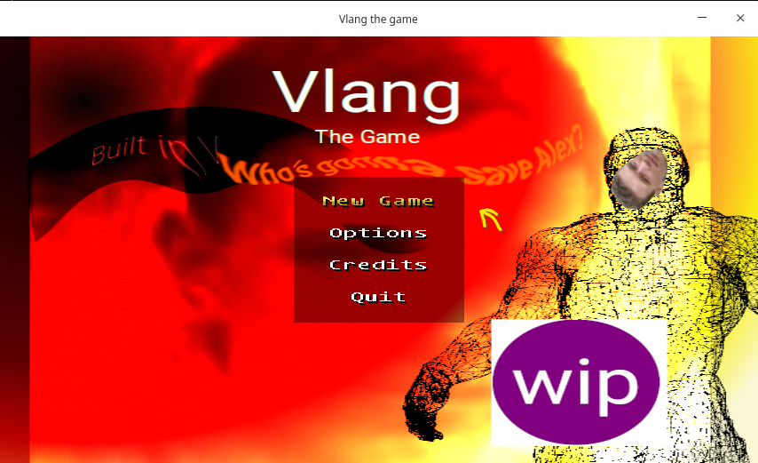

# Vlang the Game

A little platformer written in V, made purely for memes and fun.



### Credits

- [Alex Medvednikov](https://github.com/medvednikov) for [V programming language](https://github.com/vlang)
- [Julia K. aka alula](https://github.com/alula) author of this game

### Dependencies

```
Debian/Ubuntu:
sudo apt install libsdl2-dev libsdl2-image-dev libsdl2-mixer-dev libsdl2-ttf-dev
```
